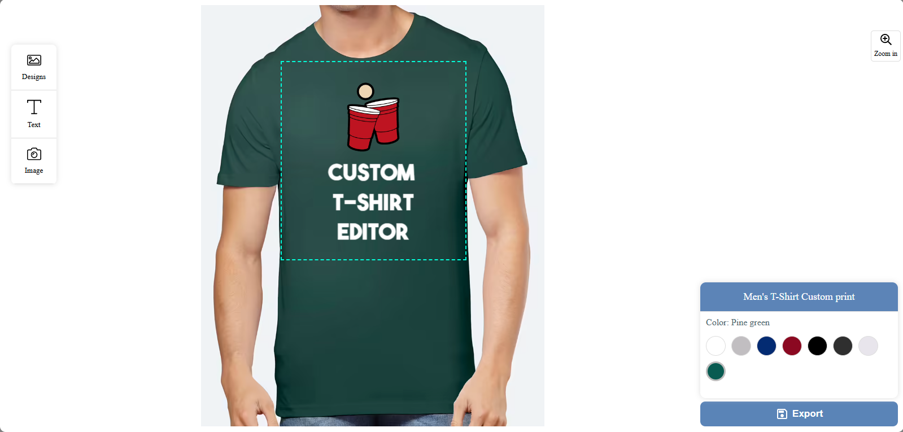
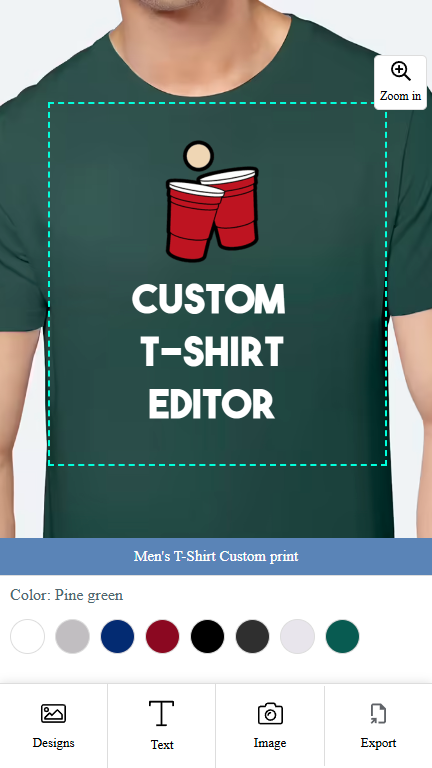

# 👕 T-Shirt Editor

A powerful and easy-to-use web-based T-Shirt Editor that allows users to create custom t-shirt designs with a wide range of tools and features. Built with responsiveness and flexibility in mind, this editor is perfect for online stores, print-on-demand businesses, or personal projects.

## 🚀 Features

### ✏️ Design Tools
- **Add Text** – Easily insert custom text on the shirt.
- **Add Image** – Upload and position images to personalize your design.
- **Change Font Family** – Choose from various fonts to match your style.
- **Print Curve Text on T-Shirt** – Create curved text that wraps perfectly on your shirt.
- **Rotate Text/Image** – Rotate elements to any angle for better positioning.
- **Delete Text/Image** – Remove unwanted elements from your design.

### 📏 Layout & Control
- **Bounding Box** – Ensure all elements stay within a defined printable area.
- **Configure Printing Area** – Customize the area that will be used for printing.
- **Layer Up/Down** – Arrange elements above or below each other for layered designs.

### 🎨 Appearance
- **Change T-Shirt Color** – Select from different shirt colors to preview your design.
- **Responsive Design** – Works perfectly on desktop, tablet, and mobile devices.

### 📤 Export Options
- **Export in HD Quality** – Download your design in high resolution.
- **Export as JPG/PNG** – Choose your preferred image format for export.

## 🛠️ Technologies Used

- **Fabric.js** – For canvas manipulation and editing
- **JavaScript** – Core logic and interactivity
- **HTML/CSS** – Structure and styling
- **IndexedDB** - For saving project as previous template
- *Optional*: Backend stack (e.g., Node.js/PHP) for saving/exporting files

## 📸 Screenshots

<p align="center">
  
  &nbsp;
  
</p>


## 💡 Use Cases

- Print-on-demand platforms
- Integrate as a popup in any website
- Custom t-shirt design stores
- Internal tools for printing companies
- Personal DIY shirt design

## 📦 Installation

```bash
# Clone the repository
git clone https://github.com/alihamza-developer/tshirt-editor.git

# Navigate into the project directory
cd tshirt-editor

# Open index.html in your browser
```

> Optional: Add build steps if you're using a bundler or backend server.

## 📄 License

MIT License – Feel free to use and modify this project for personal or commercial use.
